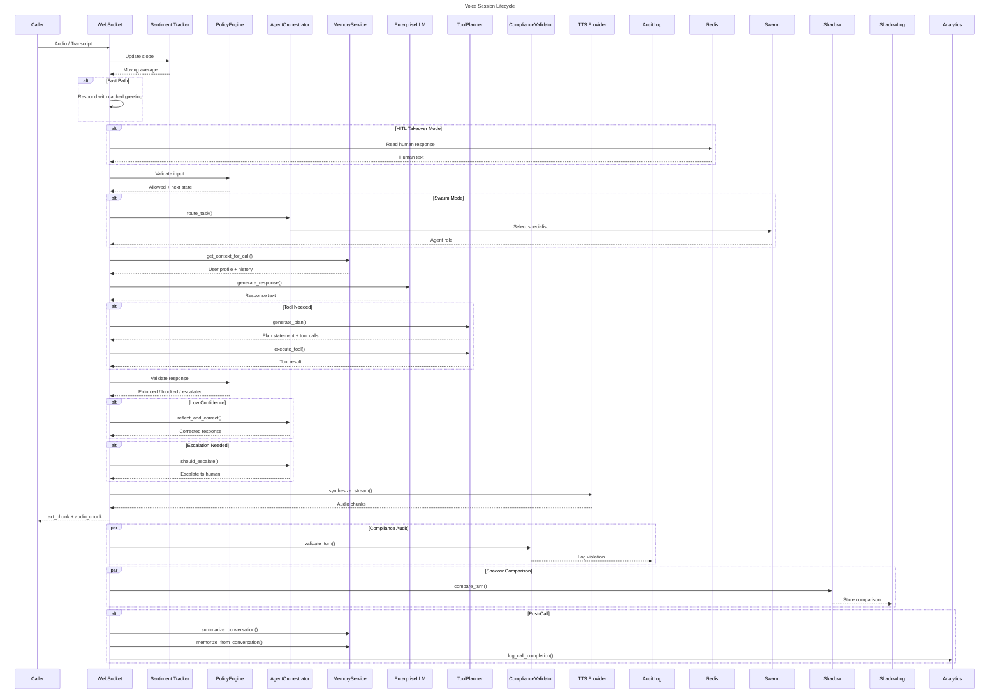
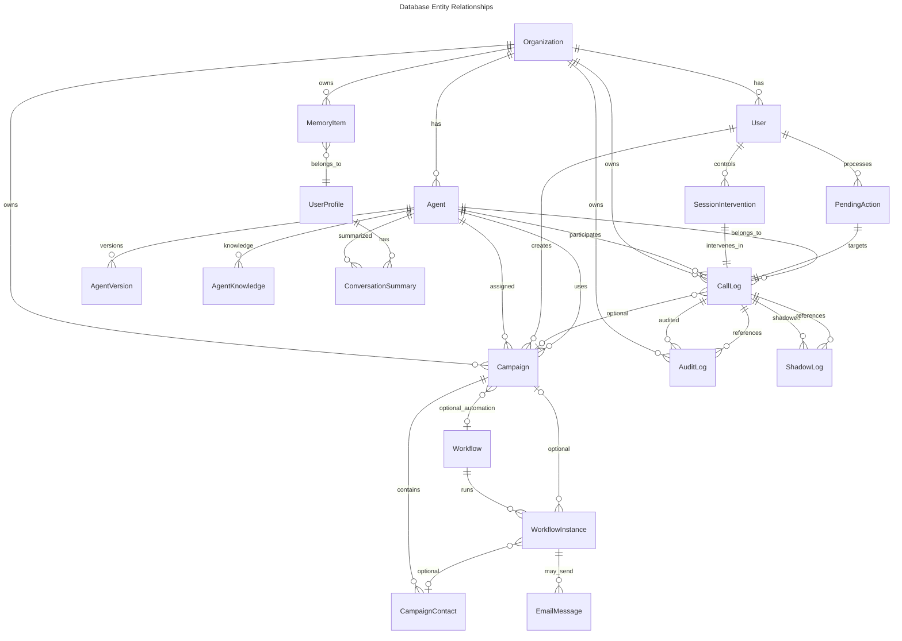
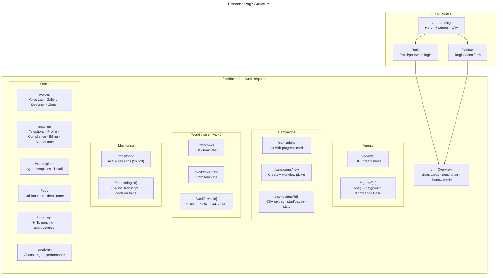
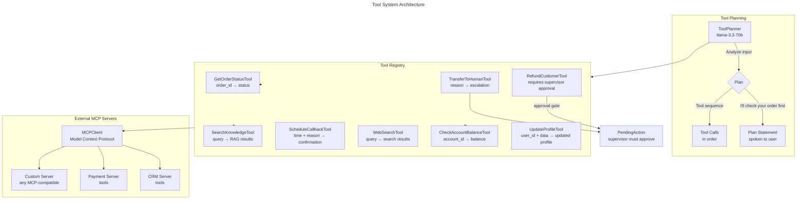
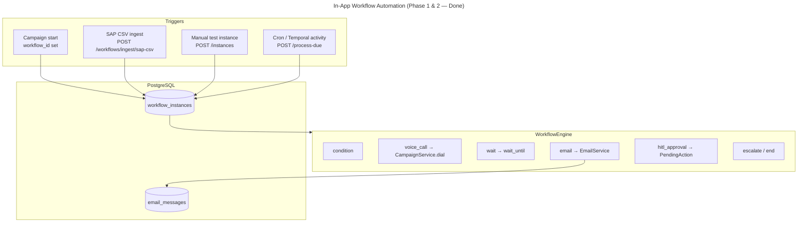

# Voise AI — Architecture Graphs

> **Workflow automation (Phase 1 & 2 — done):** see [WORKFLOW_AUTOMATION.md](./WORKFLOW_AUTOMATION.md) for implementation details, API, and operations.

```mermaid
---
title: System Architecture Layers
---
graph TB
    subgraph Clients ["Clients"]
        direction LR
        WEB[Web Browser\nNext.js Frontend]
        PHONE[Phone / SIP\nTwilio / Exotel]
        API[REST / WS\nExternal Integrations]
    end

    subgraph FastAPI ["FastAPI Backend (:8001)"]
        direction TB
        GATEWAY[API Gateway\nmain.py]
        
        subgraph REST ["REST Endpoints"]
            AUTH[/auth/*/]
            AGENTS[/agents/*/]
            CAMPAIGNS[/campaigns/*/]
            WORKFLOWS[/workflows/*/]
            ANALYTICS[/analytics/*/]
            HITL[/hitl/*/]
            MEMORY[/memory/*/]
            KNOWLEDGE[/knowledge/*/]
            TELEPHONY[/telephony/*/]
            MARKETPLACE[/marketplace/*/]
            MONITORING[/monitoring/*/]
            VOICES[/voices/*/]
        end

        subgraph WS ["WebSocket Endpoints"]
            WS_AGENT[ws /orchestrator/ws/{agent_id}]
            WS_MONITOR[ws /monitoring/stream/{session_id}]
            WS_GLOBAL[ws /monitoring/stream/all]
            WS_TELEPHONY[ws /telephony/ultravox-data]
        end

        subgraph Orchestration ["Orchestration Layer"]
            ORCH[AgentOrchestrator\nsentiment · confidence · escalation · self-correction]
            SWARM[SwarmOrchestrator\nLLM agent routing · autonomous discovery]
            LANGGRAPH[LangGraphOrchestrator\nStateGraph · specialist nodes]
            POLICY[PolicyEngine\nstate machine · guardrails · script enforcement]
            PLANNER[ToolPlanner\nplan before call · sequencing]
            SESSION[SessionManager\nRedis persistence · 24h TTL]
        end

        subgraph Services ["Service Layer"]
            LLM[LLM Providers\nGroq · OpenAI · Enterprise failover]
            TTS[TTS Providers\nQwen · Deepgram · Mock]
            STT[STT Providers\nDeepgram · Mock]
            TOOLS[Tool Registry\n8 tools · MCP client]
            MEMSVC[Memory Service\nmemorize · retrieve · summarize]
            COMPLIANCE[Compliance Service\nPII redaction · LLM audit]
            SHADOW[Shadow Comparison\nprimary vs cheap model]
            HITLSVC[HITL Service\npending actions · intervention]
            ANALYTICSSVC[Analytics Service\nstats · HMAC signing]
            KNOWLEDGESVC[Knowledge Service\nRAG · embeddings]
            WFENG[WorkflowEngine\nin-app automation v1]
            WFSVC[WorkflowService\nCRUD · instances · SAP ingest]
            EMAILSVC[EmailService\nSMTP or simulated]
            ULTRAVOX[Ultravox Service\nproxy voice runtime]
            VOICEUX[Voice UX Service\nbackchannels · fillers]
        end
    end

    subgraph Infra ["Infrastructure"]
        PG[(PostgreSQL\npgvector)]
        REDIS[(Redis\nsession · Pub/Sub)]
        TEMPORAL[Temporal\nworkflow orchestration]
    end

    subgraph External ["External Services"]
        GROQ[Groq Cloud\nLLM · llama-3.3-70b]
        DEEPGRAM[Deepgram\nSTT · TTS]
        OPENAI[OpenAI\nGPT-3.5-turbo]
        QWEN[Qwen3-TTS\nlocalhost:8008]
        ULTRAVOX_API[Ultravox API\nvoice calls]
        TWILIO[Twilio\ntelephony]
    end

    WEB -->|HTTP / WS| GATEWAY
    PHONE -->|SIP / Webhook| TELEPHONY
    API -->|HTTP| GATEWAY

    GATEWAY --> REST
    GATEWAY --> WS

    WS_AGENT --> ORCH
    WS_MONITOR --> MONITORING
    WS_GLOBAL --> MONITORING
    WS_TELEPHONY --> ULTRAVOX

    ORCH --> SWARM
    ORCH --> LANGGRAPH
    ORCH --> POLICY
    ORCH --> PLANNER
    ORCH --> SESSION
    ORCH --> LLM
    ORCH --> MEMSVC
    ORCH --> TOOLS
    ORCH --> KNOWLEDGESVC

    SESSION --> REDIS
    MEMSVC --> REDIS
    
    LLM --> GROQ
    LLM --> OPENAI
    TTS --> QWEN
    TTS --> DEEPGRAM
    STT --> DEEPGRAM
    ULTRAVOX --> ULTRAVOX_API
    TELEPHONY --> TWILIO

    REST --> WFENG
    REST --> WFSVC
    WFSVC --> WFENG
    WFENG --> EMAILSVC
    WFENG --> CAMP_SVC[CampaignService\ndial on voice_call]
    REST --> PG
    REST --> REDIS
    SERVICES --> PG
    HITL --> REDIS
```







```mermaid
---
title: Key Data Flows
---
flowchart LR
    subgraph Inbound-Call ["Inbound Call Flow"]
        A1[Phone Rings] --> A2[Twilio Webhook\n/telephony/voice]
        A2 --> A3{Ultravox?\nUSE_ULTRAVOX_RUNTIME}
        A3 -->|Yes| A4[Ultravox Proxy\nhandles real-time]\n
        A3 -->|No| A5[Self-Hosted WS\nSTT + LLM + TTS]
        A5 --> A6[Agent Response]
        A4 --> A6
    end

    subgraph RAG-Flow ["RAG Knowledge Flow"]
        B1[Agent Knowledge\nCRUD API] --> B2[(PostgreSQL\npgvector)]
        B3[User Query] --> B4[Embedding\nall-MiniLM-L6-v2]
        B4 --> B5[Cosine Search\nagent_knowledge]
        B5 --> B6[Relevant Chunks\n→ LLM Context]
        B2 --> B5
    end

    subgraph Memory-Flow ["Memory Flow"]
        C1[Conversation] --> C2[LLM Extraction\nmemorize_from_conversation]
        C2 --> C3{Consent Check\nuser_claim detection}
        C3 -->|Granted| C4[Store MemoryItem\nwith embedding]
        C3 -->|Withdrawn| C5[Skip]
        C4 --> C6[Future Calls\nget_context_for_call]
    end

    subgraph Compliance-Flow ["Compliance Flow"]
        D1[User Input] --> D2[PolicyEngine\nintent + guardrails]
        D2 --> D3[State Machine\nGREETING → DATA_COLLECTION...]
        D3 --> D4[LLM Response]
        D4 --> D5[PolicyEngine\nscript + output guardrails]
        D5 --> D6[ComplianceValidator\nshadow LLM audit]
        D6 --> D7[(AuditLog\nrisk_score + violations)]
    end
```





See [WORKFLOW_AUTOMATION.md](./WORKFLOW_AUTOMATION.md) for API and operations.
