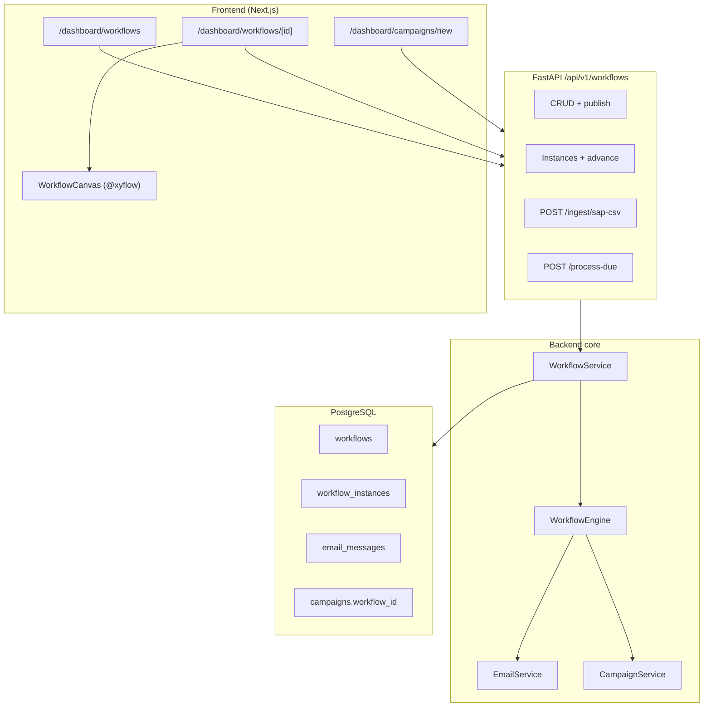

# Workflow Automation — Implementation Documentation

**Product:** Voise AI (`voice-agents`)  
**Feature:** In-app workflow automation for enterprise collections, lead qualification, and appointment follow-up  
**Status:** Phase 1 ✅ Done · Phase 2 ✅ Done · Phase 3 ✅ Done

This document describes what was built, where it lives in the codebase, and how to operate it. It is the source of truth for workflow automation through Phase 2.

---

## Phase status

| Phase | Scope | Status |
|-------|--------|--------|
| **Phase 1** | Workflow definitions, in-process engine, REST API, JSON editor UI, built-in templates, instances & test runs | ✅ **Done** |
| **Phase 2** | Visual builder (React Flow), email node + audit, SAP CSV ingest, campaign ↔ workflow linking, wait scheduler, Temporal activity hook | ✅ **Done** |
| **Phase 3** | Call-ended auto-advance, Temporal scheduler, node config panel, campaign instance UI, WhatsApp node, HITL resume | ✅ **Done** |

---

## Goals

Workflow automation runs **inside the Voise AI app** (not a separate product), with a clean backend module boundary (`backend/app/workflows/`) so it can be extracted later if needed.

Primary use case: **SAP AR collections** — ingest overdue accounts, branch by rules (VIP, aging, call outcome), voice → retry → email → HITL → escalate.

---

## High-level architecture



**Execution model (v1):** In-process async executor (`WorkflowEngine`). Instances pause on `waiting` with `wait_until`; resume via `POST /workflows/process-due` or `process_due_workflow_instances_activity` (Temporal hook, not yet wired to worker).

---

## Repository map

| Area | Path |
|------|------|
| Definition schema | `backend/app/workflows/schema.py` |
| Executor | `backend/app/workflows/engine.py` |
| Built-in templates | `backend/app/workflows/templates.py` |
| SAP field normalization | `backend/app/workflows/sap_ingest.py` |
| Service layer | `backend/app/services/workflow_service.py` |
| Email delivery + audit | `backend/app/services/email_service.py` |
| REST API | `backend/app/api/endpoints/workflows.py` |
| Router mount | `backend/app/api/api.py` → prefix `/workflows` |
| DB models | `backend/app/models/workflow.py` |
| Temporal activity | `backend/app/orchestration/workflow_activities.py` |
| Campaign integration | `backend/app/services/campaign_service.py` |
| Migrations | `backend/alembic/versions/a1b2c3d4e5f6_workflow_automation_tables.py`, `b2c3d4e5f6a7_add_email_messages_table.py` |
| Flow ↔ canvas utils | `frontend/src/lib/workflowFlow.ts` |
| Visual components | `frontend/src/components/workflows/WorkflowCanvas.tsx`, `WorkflowNodeCard.tsx` |
| List / create pages | `frontend/src/app/dashboard/workflows/page.tsx`, `new/page.tsx` |
| Editor (tabs) | `frontend/src/app/dashboard/workflows/[id]/page.tsx` |
| Campaign workflow picker | `frontend/src/app/dashboard/campaigns/new/page.tsx` |
| Tests | `backend/tests/test_workflow_engine.py`, `backend/tests/test_sap_ingest.py` |

---

## Phase 1 — Done ✅

### Backend

1. **Workflow definition schema (v1)**  
   JSON stored on `Workflow.definition`. Validated with Pydantic (`WorkflowDefinitionV1`): unique node IDs, valid graph references, `entry` node exists.

2. **Node types (v1)**  
   `start`, `condition`, `voice_call`, `wait`, `email`, `hitl_approval`, `escalate`, `end`

3. **In-process engine** (`WorkflowEngine`)  
   - Evaluates conditions (`eq`, `neq`, `gt`, `gte`, `lt`, `lte`, `in`, `contains`; `match: all|any`)  
   - Runs nodes until `waiting`, `completed`, or `failed` (max 50 steps)  
   - Writes step history into instance `context._step_history`

4. **Built-in templates** (clone via API or dashboard)  
   | Slug | Name | Category |
   |------|------|----------|
   | `collections-payment-reminder` | Collections — Payment Reminder | collections |
   | `lead-qualification` | Lead Qualification — Outbound | sales |
   | `appointment-confirmation` | Appointment Confirmation | healthcare |

5. **Persistence**  
   - `workflows` — definition, status (`draft` / `active` / `archived`), category, template metadata  
   - `workflow_instances` — per-contact/case execution, `context`, `current_node_id`, `wait_until`, links to `campaign_id`, `contact_id`, `agent_id`

6. **REST API** (`/api/v1/workflows`)  
   - Templates: `GET /templates`, `GET /templates/{slug}`  
   - Workflows: `GET /`, `POST /`, `GET|PUT|DELETE /{id}`, `POST /{id}/publish`  
   - Instances: `GET /{id}/instances`, `POST /{id}/instances`, `GET /instances/{id}`, `POST /instances/{id}/advance`

7. **WorkflowService**  
   - CRUD, publish, `create_instance` (auto-starts with `advance_instance`), `advance_instance`, template seeding

### Frontend (Phase 1)

- Sidebar: **Workflows** → `/dashboard/workflows`
- **List** — all workflows, status, link to editor
- **New** — create from scratch or from template slug
- **Editor** — JSON definition editor, save, publish, test instance with sample context, list recent instances, manual advance (e.g. `last_call_outcome`)

### Database (Phase 1)

Migration: `a1b2c3d4e5f6_workflow_automation_tables.py`  
- Extends `workflows` (category, status, version, template fields, …)  
- Creates `workflow_instances`  
- `campaigns.workflow_id` FK (nullable) — added in campaign migration / workflow migration chain

---

## Phase 2 — Done ✅

### Backend

1. **Real email node**  
   - `EmailService` sends via SMTP when `SMTP_HOST` + `SMTP_FROM` are set; otherwise **simulated** send with full audit  
   - `email_messages` table records every attempt (`queued`, `sent`, `simulated`, `failed`)  
   - Templates: `payment_reminder`, `lead_nurture`, `appointment_confirm` (subject/body from context)  
   - Config: `backend/.env.example` (SMTP_*), `backend/app/core/config.py`

2. **SAP AR CSV ingest**  
   - `sap_ingest.py` normalizes column aliases → canonical context keys (`customer_name`, `outstanding_amount`, `aging_bucket`, `email`, …)  
   - `POST /workflows/ingest/sap-csv` — multipart CSV upload; requires **published** workflow  
   - Optional: attach to existing `campaign_id` or `create_campaign_name` + `agent_id`  
   - Creates campaign contacts + starts one workflow instance per row (when `auto_start=true`)

3. **Scheduler for wait nodes**  
   - `POST /workflows/process-due` — resumes instances where `status=waiting` and `wait_until <= now`  
   - `WorkflowService.process_due_instances(limit=100)`

4. **Campaign ↔ workflow**  
   - Create campaign with `workflow_id` (API + UI)  
   - `CampaignService.start_campaign()` — for each pending contact, `create_instance()` and set contact to `queued`

5. **Active workflows API**  
   - `GET /workflows/active` — id/name for published workflows (campaign dropdown)

6. **Temporal hook (stub)**  
   - `process_due_workflow_instances_activity` in `workflow_activities.py`  
   - **Not yet registered** on the Temporal worker (Phase 3)

7. **Bug fix**  
   - `create_instance` correctly `await`s `advance_instance` when `auto_start=True`

### Frontend (Phase 2)

1. **Visual builder** (`@xyflow/react`)  
   - `definitionToFlow` / `flowToDefinition` — sync graph with `definition.canvas.positions`  
   - `WorkflowCanvas` — pan/zoom, edges for `next` / `on_true` / `on_false`  
   - `WorkflowNodeCard` — color-coded node types

2. **Editor tabs** (`/dashboard/workflows/[id]`)  
   | Tab | Purpose |
   |-----|---------|
   | **Visual** | Canvas editor, save positions + graph |
   | **JSON** | Raw definition editor (power users) |
   | **SAP ingest** | Upload CSV, optional new campaign name + agent |
   | **Test & runs** | Start test instance, advance, view instances |

3. **Campaign create**  
   - Dropdown: **Workflow automation** — lists `GET /workflows/active`  
   - Help text: published workflows run per contact on campaign start

### Database (Phase 2)

Migration: `b2c3d4e5f6a7_add_email_messages_table.py` → `email_messages`

---

## Workflow definition (v1)

Example shape (also used by templates):

```json
{
  "version": "1",
  "name": "Collections — Payment Reminder",
  "entry": "check_vip",
  "canvas": {
    "positions": {
      "check_vip": { "x": 0, "y": 0 },
      "voice_call": { "x": 220, "y": 0 }
    }
  },
  "nodes": [
    {
      "id": "check_vip",
      "type": "condition",
      "label": "VIP do-not-auto-call?",
      "config": {
        "rules": [{ "field": "vip_no_auto_call", "op": "eq", "value": true }],
        "match": "all"
      },
      "on_true": "escalate_rm",
      "on_false": "voice_call"
    },
    {
      "id": "voice_call",
      "type": "voice_call",
      "label": "Payment reminder call",
      "config": { "max_attempts": 3, "retry_delay_minutes": [240, 1440, 2880] },
      "next": "check_call_outcome"
    }
  ]
}
```

### Node reference

| Type | Behavior | Key `config` |
|------|----------|----------------|
| `start` | Jump to `next` | — |
| `condition` | Evaluate rules → `on_true` / `on_false` | `rules[]`, `match` (`all`/`any`) |
| `voice_call` | Dial via `CampaignService.dial_contact` when campaign+contact set; else planned/pending | `max_attempts`, `retry_delay_minutes[]` |
| `wait` | Instance `waiting` until `wait_until` | `minutes` |
| `email` | `EmailService.send_template_email` | `template`, `track` |
| `whatsapp` | Simulated message (logged); real provider TBD | `template` |
| `hitl_approval` | Creates `PendingAction` (HITL queue) | `action_type`, `description` |
| `escalate` | Context patch for owner role | `owner_role`, `priority` |
| `end` | Instance `completed` | `outcome` |

### Instance context (typical)

Used by collections template and SAP ingest:

```json
{
  "customer_name": "Maria Gonzalez",
  "customer_id": "C-1001",
  "email": "maria@example.com",
  "phone_number": "+15551234567",
  "outstanding_amount": 284.5,
  "aging_bucket": "31-60",
  "aging_days": 45,
  "branch_code": "BR-01",
  "vip_no_auto_call": false,
  "campaign_id": "...",
  "contact_id": "...",
  "agent_id": "...",
  "call_attempts": 0,
  "last_call_outcome": "no_answer"
}
```

Advance instances with:

```http
POST /api/v1/workflows/instances/{instance_id}/advance
{ "last_call_outcome": "answered" }
```

---

## REST API summary

Base: `/api/v1/workflows` (auth required)

| Method | Path | Phase | Description |
|--------|------|-------|-------------|
| GET | `/templates` | 1 | List built-in templates (seeds DB templates) |
| GET | `/templates/{slug}` | 1 | Full template definition |
| GET | `/` | 1 | List workflows |
| POST | `/` | 1 | Create workflow |
| GET | `/{workflow_id}` | 1 | Get workflow |
| PUT | `/{workflow_id}` | 1 | Update (incl. definition) |
| DELETE | `/{workflow_id}` | 1 | Delete |
| POST | `/{workflow_id}/publish` | 1 | Set status `active` |
| GET | `/{workflow_id}/instances` | 1 | List instances |
| POST | `/{workflow_id}/instances` | 1 | Start instance |
| GET | `/instances/{instance_id}` | 1 | Get instance |
| POST | `/instances/{instance_id}/advance` | 1 | Advance / inject event |
| GET | `/active` | 2 | Published workflows (id, name) |
| POST | `/process-due` | 2 | Resume waited instances |
| POST | `/ingest/sap-csv` | 2 | Upload CSV (query: `workflow_id`, optional `campaign_id`, `create_campaign_name`, `agent_id`, `auto_start`) |

Campaign API accepts `workflow_id` on create (`backend/app/api/endpoints/campaigns.py`).

---

## Engine execution flow

```text
create_instance(auto_start=true)
  → advance_instance
    → run_until_wait_or_done(entry or current_node)
      → for each node: execute_node
         → continue | waiting (set wait_until) | completed | failed
      → persist instance status, context, current_node_id
```

**Voice call waiting:** If outcome is pending, instance stays `waiting` until `advance` with `last_call_outcome`.  
**Retries:** Failed outcomes schedule `wait_until` and re-enter same `voice_call` node.  
**HITL:** Instance waits until external approval flow advances instance (manual advance today).

---

## SAP CSV ingest

**Canonical fields** (aliases accepted — see `SAP_FIELD_ALIASES` in `sap_ingest.py`):

- `customer_name`, `customer_id`, `branch_code`, `profit_center`
- `outstanding_amount`, `invoice_number`, `due_date`, `aging_bucket`
- `email`, `contact_number` / `phone`
- `payment_history`, `status`, `remarks`

Rows without phone/contact number are skipped. `aging_days` may be derived from bucket string.

**UI:** Workflow editor → **SAP ingest** tab → upload file, agent, optional campaign name.

---

## Operations

### Migrations

```bash
cd backend
alembic upgrade head
```

Requires Postgres (see `docker-compose.yml`). Applies at minimum:

- `a1b2c3d4e5f6` — workflow_instances + workflow columns  
- `b2c3d4e5f6a7` — email_messages  

### Email (optional)

```env
SMTP_HOST=smtp.example.com
SMTP_PORT=587
SMTP_USER=...
SMTP_PASSWORD=...
SMTP_FROM=collections@yourcompany.com
SMTP_USE_TLS=true
```

Without SMTP, emails are **simulated** and still appear in `email_messages`.

### Resume waited workflows (cron)

```bash
curl -X POST -H "Authorization: Bearer $TOKEN" \
  http://localhost:8001/api/v1/workflows/process-due
```

Recommended: every 1–5 minutes, or register `process_due_workflow_instances_activity` on Temporal worker (Phase 3).

### Tests

```bash
cd backend
pytest tests/test_workflow_engine.py tests/test_sap_ingest.py -v
```

### End-to-end smoke (Phase 1 + 2)

1. Login (e.g. demo `demo@voise.ai` / `DemoVoise2026!` if seeded).  
2. **Workflows** → New from template `collections-payment-reminder` → Publish.  
3. Editor → **Visual** — adjust graph → Save.  
4. **Test & runs** — start instance with sample JSON context → Advance with call outcomes.  
5. **SAP ingest** — upload sample CSV → verify instances/campaign.  
6. **Campaigns** → New → select workflow → add contacts → Start campaign.  
7. Optional: configure SMTP and verify `email_messages` after email node runs.

---

## Phase 3 — Done ✅

### Backend

1. **Call-ended → workflow advance**  
   - `app/workflows/call_outcome.py` maps analytics/end reason → `last_call_outcome`  
   - `UltravoxWebhookService.handle_call_ended` calls `WorkflowService.advance_on_call_ended` per `campaign_contact_id`  
   - Response includes `workflow.advanced` count

2. **HITL approval → workflow resume**  
   - `POST /hitl/{id}/decide` with `approved` advances instances whose context has matching `pending_approval_id`

3. **Temporal scheduler**  
   - `WorkflowDueSchedulerWorkflow` in `app/orchestration/workflow_scheduler.py`  
   - Worker registers `process_due_workflow_instances_activity` + auto-starts scheduler on `python -m app.orchestration.worker`

4. **WhatsApp node** (`whatsapp`)  
   - Simulated send (logs + context patch); template in `config.template`  
   - Real provider integration deferred

5. **Campaign API enrichment**  
   - `GET /campaigns/{id}` includes `workflow` summary  
   - `GET /campaigns/{id}/contacts` includes `workflow_instance` per contact

### Frontend

1. **Node config panel** — `WorkflowNodeConfigPanel.tsx` beside canvas (label, voice/email/wait/HITL/escalate/end fields)  
2. **Campaign detail** — workflow banner, link to editor, per-contact instance status in dial list  
3. **Visual builder** — `+ WhatsApp` node type

### Still planned (Phase 4+)

| Item | Description |
|------|-------------|
| Organization scoping | Filter workflows/instances by `organization_id` |
| Real WhatsApp provider | Twilio / Meta Business API |
| Condition rules UI | Visual editor for `config.rules` (JSON today) |

---

## Design notes

- **Module boundary:** Keep orchestration in `app/workflows/` + `WorkflowService`; telephony stays in `CampaignService` / orchestrator.  
- **Temporal:** Engine is synchronous-friendly; activity already delegates to `process_due_instances`. Full durable execution is Phase 3.  
- **AGENTS.md alignment:** Templates encode goals/branches (VIP, retries, escalation). Future: explicit success/failure YAML, confidence on STT outcomes, memory governance on context writes.

---

## Changelog

| Date | Phase | Notes |
|------|-------|-------|
| 2026-05 | 1 ✅ | Schema, engine, API, JSON UI, templates, instances |
| 2026-05 | 2 ✅ | Visual builder, email, SAP ingest, campaign link, process-due, Temporal activity stub |
| 2026-05 | 3 ✅ | Call-ended advance, Temporal scheduler, config panel, campaign WF UI, WhatsApp node, HITL resume |

---

*For system-wide architecture (voice stack, Temporal call workflows, HITL), see [ARCHITECTURE.md](./ARCHITECTURE.md).*

*Documentation index: [DOCS.md](./DOCS.md)*
